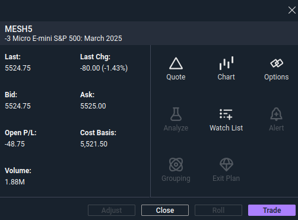

# Futures Live

## Micro | MNQ | Nasdaq Drop | March expiry
- placed: `2025-03-13 12:38:42`  

- cost basis: 19249.25
- qty: 5
- stop loss placed: 20,000 `2025-03-13 12:40:40`
    - max loss calc  
    

### Reasons
- NQ in descending channel
- cook over time
-  moves happen overnight

## Micro | MES | SPY Drop | March expiry
- placed `2025-03-13 12:59:44`  

- cost basis: 5521.50
- qty: 3
- stop loss placed: 5730.00 `2025-03-13 12:57:34`
    - max loss calc  
    

### reasons
- same as NQ above
