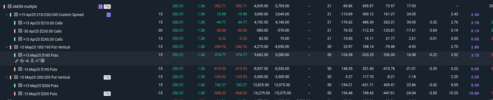

## NVDA | Put Wedge Hammer
placed: `2025-03-27 09:11:30` | ET Main

## AVGO | Put Call butterfly hybrid
placed: `2025-03-27 10:35:55` | ET MAIN

Reasons:  
- very low loss
- avgo damn cheap, near resisitance
- it can go up with nasdaq
- 200-240 range is probable

### QQQ | Put Call butterfly hybrid
placed: `2025-03-27 11:17:37` | ET Main

### AMZN | put call butterfly hybrid
placed: `2025-03-27 11:17:37` | ET Main  

### Meta | Call butterfly + put spreads
placed: `2025-03-27 11:37:27` | Schwab

