## Idea: Plant directional hybrid option structures

### Gist
- Plant hybrid option structures with a directional bias and high probable zones
- Plant in numbers and let it flourish over time

### Thread 01 | Tesla Case as of `2025-03-25 14:16:23`
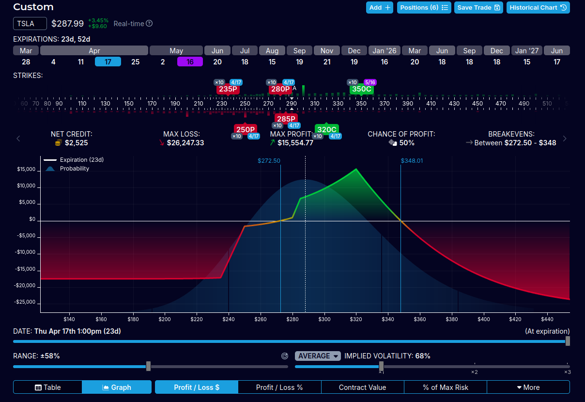
Reasons:
- Where is the directional outlook
    - Has it changed to bullish near term
- upper and lowe resistance levels are high probable and visible
- momentum established

---
## Idea: Plant Longer term Directional Diagonals

### Gist
- easy to construct and find them
- keep looking for them based on the outlook

### Prereqs
- strong consensus and momentum towards a direction
- identifiable exhausted bottom levels

#### GOOGLE exmaple : constructed `2025-03-26 00:22:19`
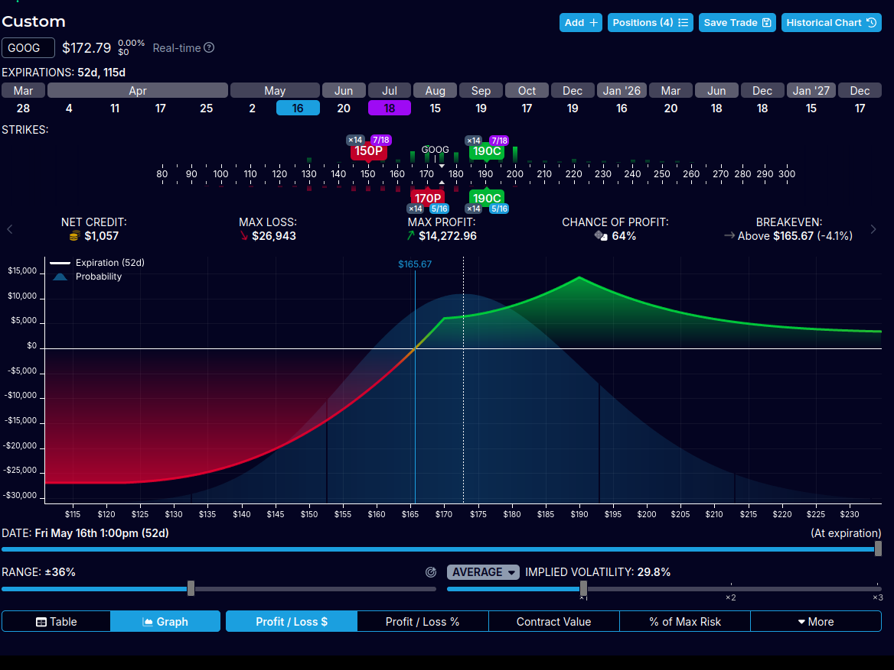

### Alternative | hybrid butterfly
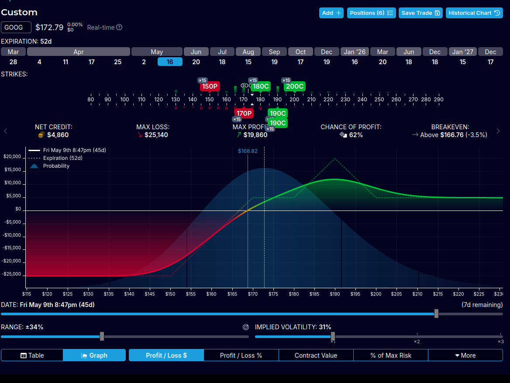

---
## Idea: Just Sell put spreads or call spreads at the money, optionally with a landing strip
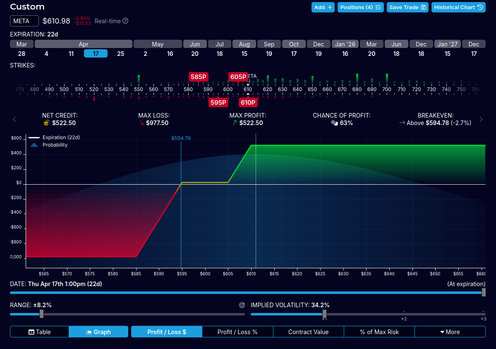

### Circumstances
- direction is known or bold predictions where made (external sources)
- easy setups are available

### Instructions
- be on the look out and mine for easy setups based on support and resistance levels
- spread across the next three months, or even longer

### Example
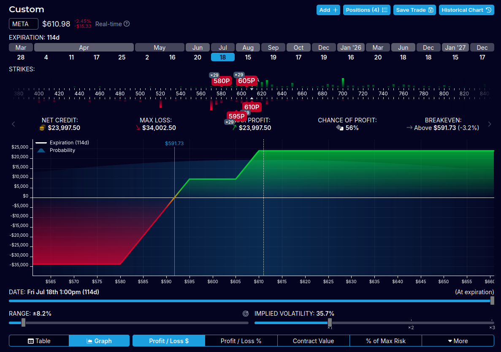
You just created 23k for July (`2025-03-26 23:12:28`)

---
## Idea: At the bottom end or top end, put spiked wedges
### Construction
- use unequal weightage

### Circumstances
- longterm bullish pressure, and bold predictions
- exhausted indications in RSI, SMI etc  
    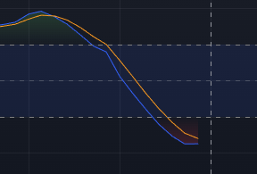

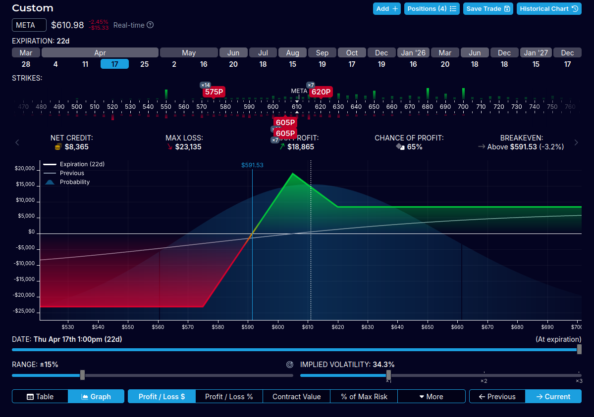

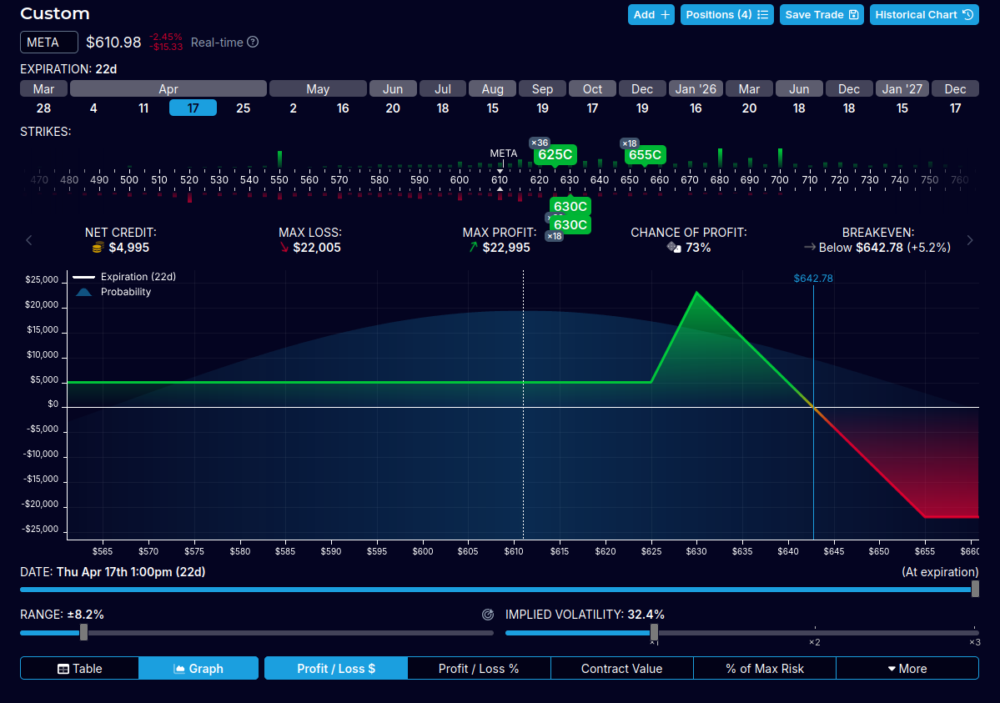
### Reasons and justification
- spring board effect  
    

---
## Idea: Leap on Micro Leap - deep in the money call/put runners
### Circumstances
- Longer term bullish reversal or direction probable
- maximum use of bulls runs
- overnight gap ups possible

### Reasoning
- occasional reverals can be covered with covered PMCC calls
- buy the dip - approach
- carve out the the occasional cyclic reversals (using oscillators Lux Algo, SMI etc), by selling calls or puts  
    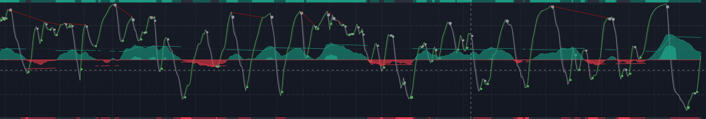  
    Lux Wave Osc

    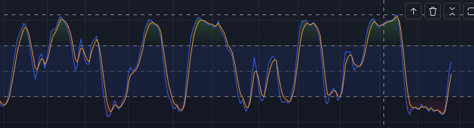  
    SMI

---
## Idea: Butterfly, high probability zones
### Reasoning
- low loss
- there is a high probability the the prices will oscillate through the zone
### Construction
- Start with an iron butterfly, call butterfly or put butterfly
- can be lopsided (not symmetric)

---
## Idea: Calendar, high probability zones
### Reasoning
- low loss
- there is a high probability the the prices will oscillate through the zone
- easier to construct and manage

### Construction
- Start with an iron butterfly, call butterfly or put butterfly
- can be lopsided (not symmetric)
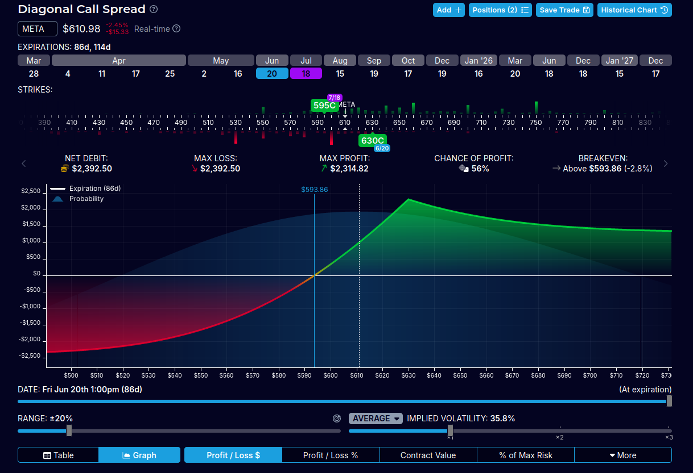

---
## Idea: Neutralize or boost delta based on the high level direction
### Gist
- dollar cost average spread or directional plays over time
- leave enough room to place opposing delta structures to neutralize or occassionally reverse the delta 
- idea is to keep the structures for the long term so you are in the market
### Reasoning
- be in the market

### Caution
- you need to leave enough caital to be able to create opposing strategies

---

